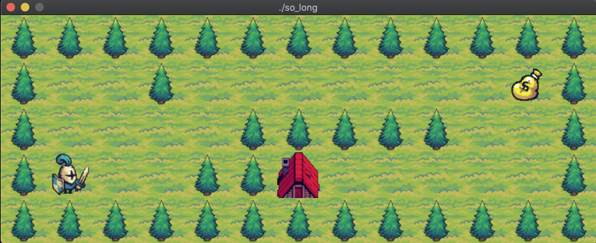

# so_long

so_long is a 42 school project to create a simple 2D game built using MiniLibX, a lightweight graphical library. This project focuses on fundamental computer graphics concepts such as window management, textures, sprites, event handling, and basic game mechanics. It serves as a practical exercise in C programming, improving problem-solving skills while working with graphical elements. The game requires finding and implementing quality assets like tiles and sprites while respecting copyright guidelines..



## Status

Passed 100%

## Clone

Clone the repository including the MiniLibX submodule:

```sh
https://github.com/Josip2504/so_long.git
```
## Comple and Run

To compile the mandatory part, cd into the cloned directory and:
```sh
make
```

To run the program:
```sh
./so_long <path/to/map.ber>
```
The program takes a map file as an argument. For example:

- `./so_long map1.ber` should run.


## Controls

Controls for movement and rotation are:

- `W`: move up
- `S`: move down
- `A`: move left
- `D`: move right
